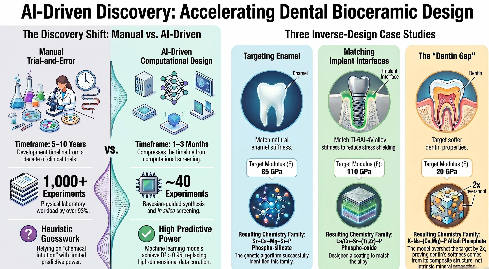

# Inverse Design of Bioceramics by Machine Learning — Code & Data



Reproducibility package (**code + output data**) for the machine-learning inverse
design of dental/biomedical ceramics. A gradient-boosting surrogate trained on
Materials Project oxygen-bearing compounds maps composition → mechanical properties (Young's modulus
*E*, Vickers hardness *H*, density *ρ*); a genetic algorithm then *inverts* that
surrogate to propose charge-balanced oxide compositions matching a prescribed
property fingerprint. A five-model machine-learning force-field (MLFF) structural screen and several no-DFT
robustness analyses close the loop.

> **Authors:** Jwerai Hoque Nowrin · Saifuddin Zafar · Md Habibur Rahman
> **Contact:** rahma103@purdue.edu
> These are **computational hypotheses**, not validated dental materials. The
> manuscript is published separately; this repository provides the code and data.

> **Updated for the major revision, September 2026.** The revision re-ran the
> validation, the enumeration and the stability screen. Three results stated in the
> first version of this README changed and are marked **[revised]** below. The
> numbers quoted here are the ones carried by the revised manuscript and by the CSVs
> in `01_data/`.

---

## The four showcases

| # | Target | Fingerprint | Outcome |
|---|--------|-------------|---------|
| **1 — Enamel** | tooth enamel | *E* ≈ 85 GPa, *H* ≈ 4 GPa, *ρ* ≈ 3.0 g/cm³ | ✅ Sr–Ca–Mg–Si–P phospho-silicate family, e.g. SrCaSiP₂O₉ |
| **2 — Dentin** | tooth dentin | *E* ≈ 20 GPa, *H* ≈ 0.7 GPa, *ρ* ≈ 2.1 g/cm³ | **[revised]** shortlist predictions stay at 44–51 GPa; exhaustive enumeration of the decoder's reachable set (17,798 formulas) gives a minimum prediction of 39.6 GPa for K₁₂Ca₂P₁₀O₃₃, whose interval still includes 20 GPa |
| **3 — Implant interface** | Ti-6Al-4V stiffness match | *E* ≈ 110 GPa, *ρ* ≈ 4.4 g/cm³ | ✅ La/Ce–Sr–P phospho-oxide family, e.g. La₂CeMg₂(PO₆)₂ |
| **4 — Stability** | all 45 GA candidates | 5-MLFF structural screen | **[revised]** consensus energies sit 0.16–0.96 eV/atom above the per-model hulls (mean ≈ 0.48), but only 12–32% of trial relaxations reached the 0.05 eV/Å force criterion and the trial-to-trial energy spread is 1.23–3.46 eV/atom, so the sampling does not establish the lowest-energy structures; each candidate decomposes into a 2–5-phase mixture |

The same pipeline is reused for all three design cases — **only the training-data
slice, the genetic-algorithm cation pool, and the property target change.**

---

## Repository structure

```
.
├── 01_data/                 input data + GA outputs
│   ├── mp_data.csv              MP training table, oxygen-bearing (N=1,721)
│   ├── dentin_data.csv          biocompatible-oxide subset (N=531)
│   ├── shortlist.csv            Zr-O virtual-screening shortlist
│   ├── designed_compositions.csv          GA candidates — enamel
│   ├── designed_dentin_compositions.csv   GA candidates — dentin
│   ├── designed_implant_compositions.csv  GA candidates — implant
│   ├── stability_check.csv      MP convex-hull results (all 45 candidates)
│   ├── synthesizable_candidates.csv       charge-balance / formula audit
│   ├── uncertainty_intervals.csv          cross-conformal prediction intervals
│   ├── pareto_*.csv             NSGA-II Pareto fronts
│   ├── enumeration_modulus.csv  exhaustive charge-balanced enumeration
│   ├── model_*.joblib           6 trained surrogates (enamel + dentin × 3)
│   ├── revision_*.csv           revision analyses (validation, enumeration,
│   │                            search baseline, sweep, mixtures, sampling)
│   └── audit_*.csv              calculation-level audit outputs
├── 02_scripts/
│   ├── paths.py                 shared path constants
│   ├── features.py              composition featurizer (Magpie + structural)
│   ├── pipeline/                pull data → train → screen → GA inverse design
│   ├── figure_scripts/          figure-generation code
│   └── analysis/                stability check, synthesizability, uncertainty,
│                                enumeration, and the revision analyses
└── 05_config_envs/
    └── requirements.txt         pinned Python environment
```

> The trained surrogates live in `01_data/` beside the tables they were fitted on;
> every analysis script loads them from there.

> A Materials Project API key is **required only** for the data-retrieval and
> stability-check steps and is **not** included here. Provide your own
> ([Materials Project](https://next-gen.materialsproject.org/api)) via the
> `MP_API_KEY` environment variable or `01_data/mp_key.txt`. All downstream
> training, inverse design, and analysis run from the provided CSVs with no
> network access.

---

## Installation

```bash
python3.9 -m venv .venv && source .venv/bin/activate
pip install -r 05_config_envs/requirements.txt
```

Key dependencies: `pymatgen`, `mp-api`, `matminer`, `scikit-learn`, `pymoo`,
`pandas`, `matplotlib`.

---

## Reproducing the results

Run from the repository root.

```bash
# Showcase 1 — Enamel
python 02_scripts/pipeline/pull_data.py            # MP oxides     → 01_data/mp_data.csv
python 02_scripts/pipeline/train.py                # 3 surrogates  → 01_data/model_*.joblib
python 02_scripts/pipeline/screen.py               # Zr-O screen   → 01_data/shortlist.csv
python 02_scripts/pipeline/inverse_ga.py           # GA design     → 01_data/designed_compositions.csv

# Showcase 2 — Dentin
python 02_scripts/pipeline/pull_data_dentin.py
python 02_scripts/pipeline/train_dentin.py
python 02_scripts/pipeline/inverse_ga_dentin.py

# Showcase 3 — Implant interface (reuses Showcase 1 surrogates)
python 02_scripts/pipeline/inverse_ga_implant.py

# Showcase 4 — Convex-hull stability check (all 45 candidates)
python 02_scripts/analysis/stability_check.py

# No-DFT robustness analyses
python 02_scripts/analysis/uncertainty_domain.py   # cross-conformal prediction intervals
python 02_scripts/analysis/enumerate_space.py      # exhaustive enumeration
python 02_scripts/pipeline/inverse_pareto.py       # NSGA-II Pareto fronts

# Revision analyses (September 2026) — every number the revision reports
python 02_scripts/analysis/revision_validation.py          # grouped/chained validation  → revision_validation.csv
python 02_scripts/analysis/revision_search_baseline.py     # random-search control       → revision_search_baseline.csv
python 02_scripts/analysis/revision_decoder_image.py       # the decoder's exact image   → audit_decoder_image*.csv
python 02_scripts/analysis/enumeration_from_image.py       # enumeration over that image → revision_enumeration*.csv
python 02_scripts/analysis/revision_sweep_and_front.py     # exact fitness-weight sweep  → revision_weight_sensitivity.csv
python 02_scripts/analysis/revision_mixture_and_chemistry.py  # decomposition mixtures   → revision_mixture_modulus.csv
python 02_scripts/analysis/revision_sampling_and_holdout.py   # sampling convergence     → revision_sampling*.csv
python 02_scripts/analysis/revision_referee2.py            # R² protocols, weight sweep  → revision_r2_protocols.csv
python 02_scripts/analysis/revision_audit_v2.py            # calculation-level audit     → audit_*.csv
python 02_scripts/analysis/fix_consensus_median.py         # consensus over valid models → stability_mlff.csv
```

The full per-candidate results for **all 45 GA compositions** (predictions, hull
energies, decompositions, synthesizability flags, conformal intervals) are in the
CSVs under `01_data/` — primarily `stability_check.csv`,
`synthesizable_candidates.csv`, and `uncertainty_intervals.csv`.

---

## Headline results

- **Surrogate models [revised]:** the modulus figure depends entirely on the protocol, so every
  protocol is now reported rather than one number. With chemical-system-grouped folds and the
  chained structural descriptors the workflow actually uses, mean absolute error is 38.1 GPa for
  the enamel/implant model and 50.4 GPa for the dentin model (*R²* on log₁₀*E* of 0.607 and 0.347).
  With database descriptors, the mean of unshuffled fold scores is *R²* = 0.742 at 31.0 GPa and the
  pooled shuffled out-of-fold value is 0.812 at 25.5 GPa. The full table is
  `01_data/revision_r2_protocols.csv`. The previously quoted "*R²* = 0.74 with MAE ≈ 24 GPa"
  pairs a score from one protocol with an error from another and matches none of them.
- **Enamel:** Sr–Ca–Mg–Si–P phospho-silicate family, predicted *E* 96–105 GPa (best fitness 0.145).
- **Dentin [revised]:** the 15 shortlisted compositions predict 44–51 GPa. Enumerating the
  decoder's reachable set gives 17,798 dentin formulas with a minimum prediction of 39.6 GPa
  (K₁₂Ca₂P₁₀O₃₃). That minimum is the minimum of this surrogate over that set. Its interval
  includes 20 GPa, and interval coverage falls to 53% for the 17 dentin-pool entries below 40 GPa
  against a nominal 90%, so it is not a lower bound on the stiffness of oxides.
- **Implant:** La/Ce–Sr–P phospho-oxide family, predicted *E* 102–117 GPa.
- **Stability [revised]:** consensus energies lie 0.16–0.96 eV/atom above the per-model hulls,
  mean ≈ 0.48. Only 12–32% of the trial relaxations reached the force criterion and the
  trial-to-trial energy spread is 1.23–3.46 eV/atom, larger than the reported energies above hull
  for 43 of the 45 candidates. The screen therefore does not establish that the candidates are
  unstable; it reports what the present sampling found.
- **Interval coverage [revised]:** the intervals are cross-conformal, built from pooled out-of-fold
  residuals of the whole prediction chain. Nested coverage is 0.908 for the full pool and 0.919 for
  the dentin pool against a nominal 0.90 (`01_data/audit_nested_coverage.csv`), but it is 71% below
  40 GPa and 54% below 20 GPa for the full pool, so the overall figure does not describe the
  low-modulus region the dentin case depends on.

---

## Honest scope

- Models predict MP-computed **elastic** properties — **not** flexural strength, fracture
  toughness, fatigue, or wear (microstructure-governed; absent from MP).
- The GA does not enforce thermodynamic stability; Showcase 4 examines it post hoc with a
  five-model MLFF screen over PyXtal trial structures. The relaxations did not converge for most
  trials, so the energies above hull are sampling estimates and not established upper bounds.
- The five force fields are not independent checks. Their training data overlap and their
  median model-to-model range, about 0.405 eV/atom, is comparable to the mean energy above hull.
- Hardness and modulus are both algebraic functions of the same DFT *K*, *G* — partially
  collinear, not independent constraints.
- Model error exceeds the spread among top candidates under every protocol, so fitness values
  indicate convergence and not a meaningful ranking among shortlisted compositions.
- The training pool is oxygen-bearing chemistry, not strictly oxides, and its softest entries are
  molecular and hydrous solids. That is where the surrogate is least reliable and where the
  dentin target sits.

---

## License

Released under the MIT License (see `LICENSE`). If you reuse the data, please also cite
the accompanying manuscript. A `CITATION.cff` is provided for GitHub's "Cite this
repository" feature.
